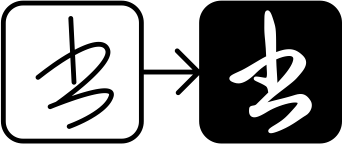
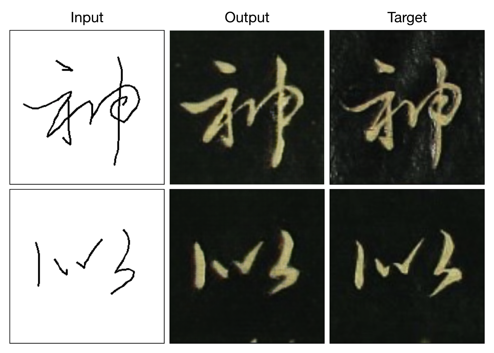

# edges2calligraphy
*From scribbles to Chinese calligraphy* （潦草字->赵体草书）
### Interactive demo: https://lingdong-.github.io/edges2calligraphy/

This project uses a neural network called [pix2pix](https://arxiv.org/pdf/1611.07004.pdf) to transfer your scribbles into Chinese Calligraphy. It is trained on ~200 cursive characters from [Zhao Mengfu](https://en.wikipedia.org/wiki/Zhao_Mengfu)'s *Thousand Character Classic in Regular and Cursive Script* (《赵孟頫真草千字文》), labeled using custom software. It is largely based on [affinelayer's edges2cats demo](https://affinelayer.com/pixsrv/) and [pix2pix-tensorflow](https://github.com/affinelayer/pix2pix-tensorflow) project, and uses [deeplearn.js](https://deeplearnjs.org) to perform GPU accelerated computation in your browser.

Try the online deomo: https://lingdong-.github.io/edges2calligraphy/. (Tested in Chrome and Firefox. Does not work in Safari.)

## Examples

## Training

This project uses [pix2pix-tensorflow](https://github.com/affinelayer/pix2pix-tensorflow) for training. See [`/tools/README.md`](/tools/README.md) for details.
