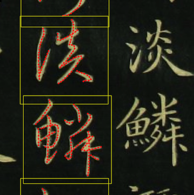

# edges2calligraphy/tools



Process images containing calligraphy samples for pix2pix training. 

400 characters from [Zhao Mengfu](https://en.wikipedia.org/wiki/Zhao_Mengfu)'s *Thousand Character Classic in Regular and Cursive Script* (《赵孟頫真草千字文》) ([download here](https://shuge.org/ebook/zhencao-qianziwen/)) were labeled and ~200 were used in training to produce the results in the demo. However, any Chinese calligraphy or calligraphic imagery can potentially be labeled using this tool.

## Usage

To annotate an image, first `cd` into `./tools` and

```
python annotate.py image.png
```

Use `-s` option to specify width of a single character (in pixels). Default is 220.

### Annotation UI

First press `s` to mark the boundaries of a new character, then press `a` to start a new polyline. Move your cursor to draw, and press `a` again to end the polyline. Pan the window with arrow keys. Press `z` to undo and `o` to save your progress.

Information about each annotated character, including polyline coordinates, source image path, and stroke order, will be stored in `out.json`

### "Side-by-side" setup for pix2pix-tensorflow

Once all the charaters are annotated, use

```
python data.py
```
to convert all the data into pix2pix-tensorflow-ready, side-by-side, annotation-on-the-right, 256p, images. The output will be stored in `dataset` folder.

### Training

Use [pix2pix-tensorflow](https://github.com/affinelayer/pix2pix-tensorflow) for training. Detailed instructions can be found in the said project's README.md.